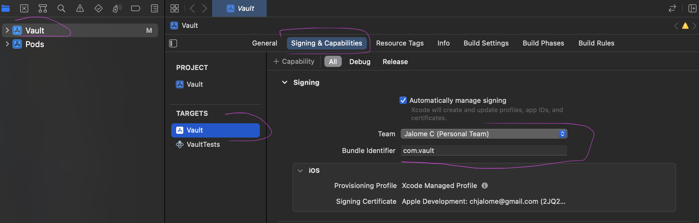

# vault app

## Description

The Vault app is an ecommerce shoe app that allows users to view and purchase shoes. Users can view shoes by category, add shoes to their cart, and checkout. Users can also view their profile and see their purchase history.

## Running the app

To run the app you'll need to have the following installed:

1. [Yarn](https://yarnpkg.com/getting-started)
2. [Node](https://nodejs.org/en) (version 14 or higher)

Once you have those installed, clone the repo and follow these steps:

1. `cd` into the `vault` directory
2. Run `yarn install` to install the dependencies
3. `cd` into the `ios` directory and run `pod install`
4. `cd` back into the `vault` directory and run `npm start` to start Metro

To run the app on iOS:

1. Open the `vault/ios/vault.xcworkspace` file in Xcode.
2. Under signing & capabilities, select your team. If you don't have a team, you'll need to create one by logging into your Apple/Icloud account. Please see the screenshot below for reference.

3. Clean and build the project by clicking `Product > Clean Build Folder` and then `Product > Build`.
4. Once the build is successful, run the project by clicking the play button in the top left corner of Xcode.
